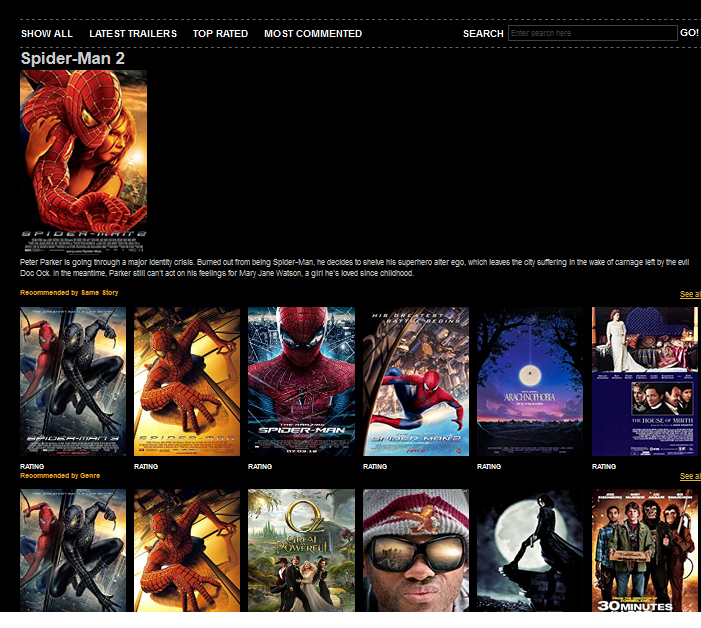

# Flask_Movie_Recomender
Simple Web base user-item movie recommendation system engine using Demographic Filtering and where Demographic Filtering generalized recommendations based on and/or popularity genre and Content-based filtering (CBF) methods are based on a profile of the user‟s preference and on a description of the item. In this filtering to describe the items,keywords are used and then a user profile is built to indicate the type of item this user likes

### Sreenshot

#### HomePage


#### Movie Detail Page


### Technologies Used
HTML, CSS, JQuery, FLASK

#### Machine Learning Library In Python3
Numpy , Pandas , Surprise

### Database
CSV

##### Requirements
- Python 3.7.4
- Flask 1.1.1
- Pandas 0.25.3
- Numpy 1.17.4

##### Setup to run

Extract zip file in your computer

Read read.txt in model directory

Open terminal/cmd promt

Goto that Path

```
pip install -r requirements.txt
```

### Creating Local Server

Goto src directory, example

```
cd ../Flask_Movie_Recomender
```
To run
```
python app.py
```
Now open your browser and go to this address
```
http://127.0.0.1:5000
```
### Traing Process
You can see Training process from here
[Click Here](https://github.com/ymeysa25/Movie-Recommender-System)

Thank you for visiting my repository.

Don't forget to give star!!

